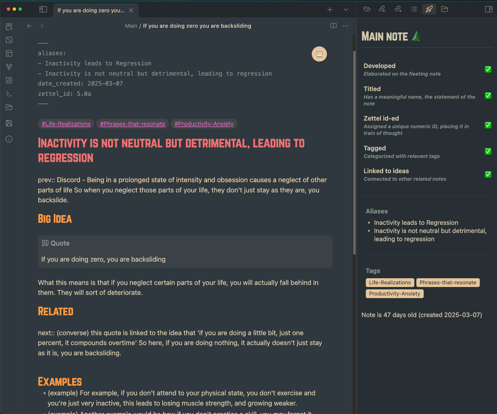

# Zettel Status Sidekick

Welcome to **Zettel Status Sidekick**—an Obsidian plugin designed to help you visualize and track the development of the note you are currently working on. This project is meant to be an opinionated sidekick that follows Bob Doto’s *A System for Writing* Zettelkasten style. 

What Is It?

Imagine a trusty sidekick that keeps you on track as your fleeting ideas evolve into fully fleshed-out notes. Zettel Status Sidekick does exactly that by providing a visual checklist right in your Obsidian workspace

Process notes with an easy visual checklist at the side. One glance assessment for whether your fleeting note is ready to become a main note.

## The Workflow: From Fleeting Note to Main Note

This workflow is a practical guide to evolving a fleeting idea into a complete, connected main note. Here’s how I do it:

1. **Developed Idea:** 
   - **Start with a Fleeting Thought:**Jot down a quick idea—like “We need to test rational things to see if they are false assumptions.”
   - **Reflect:**Ask yourself, “Is there a reminder, a task, or a potential insight here?”

2. **Core Idea:** 
   - **Expand Your Thoughts:**Open a new note (digital or physical) and rewrite the fleeting idea into clear, complete sentences.  
   - **Example:**“Rational thought should be tested to determine if it’s based on false assumptions.”

3. **Connected Idea:** 
   - **Link to Existing Notes:**Look through your Zettelkasten for related ideas—perhaps a note on the scientific method or cognitive biases.  
   - **Add Context:**For every link, briefly explain the connection. For instance:  
     - *See note on **Scientific Method**: Testing assumptions is crucial for forming and validating hypotheses.*  
     - *See note on **Cognitive Biases**: Challenging rational thoughts helps uncover biases that lead to false assumptions.*

4. **Alphanumeric ID:** 
   - **Index Your Thoughts:**Assign a unique alphanumeric ID (e.g., 1.2a) that shows where this note fits in the chain of ideas. This is 'how were my thoughts flowing at that time' rather than trying to give it more structure. If you want to organize into an essay, link it to a hub note (a note in the Hub folder).

5. **Permanent Note Title:** 
   - **Name It Clearly:**Craft a concise, declarative title like "Logic is a lie, experiment to expose false assumptions” that encapsulates the idea perfectly.

6. **Transfer to Main Notes Folder:** 
   - **File Your Note:**Once it’s fully developed and connected, move your note to your main notes folder to keep your vault organized and your ideas accessible.

Summary of the stages :
1. (Developed Idea) Idea → More thoughts on this idea
2. (Core Idea) Rewrite idea into complete note that others can understand 
3. (Connected Idea) Link to existing notes - Compass of Ideas - with context for each link
4. Add Alphanumeric ID - Where is this in the chain of thought 
5. Permanent note title - a statement that encapsulates the argument of this note
6. Transfer to Main Notes folder

## Description
Tired of manually assessing which notes are fully fleshed out and which are still just fleeting ideas? Zettel Status Sidekick is here to help! This Obsidian plugin provides a handy side panel that displays the current status of your active note based on a series of customizable checks. It's designed to be a visual aid in your note-taking workflow, particularly if you're using the Zettelkasten method.

The plugin checks various criteria you define, such as note length, presence of tags, links to other notes, and more, to give you a quick overview of how "complete" a note is. You can configure these checks to match your personal note development process and easily see at a glance which notes need more work and which are ready to be considered more permanent pieces of your knowledge system.

- 📝 Dynamic Note Status Panel: A dedicated side panel that shows your note’s status at a glance. Open it via a ribbon icon or a quick command.
- ✅ Customizable Status Checks: Define what a “developed” note means for you. Options include:
  - 📏 Developed: Checks if a note has been worked on (length of note exceeds a configurable character threshold).
  - ✍️ Titled: Verifies that the note's filename contains letters, suggesting a meaningful title. Because I usually do Obsidian's unique note creator until I am ready to give this note a permanent statement.
  - 🆔 Zettel ID: This is a meta-data field to help identify where this note falls in the train of thought when you were creating it. It is the 1.5a2.0 type of naming scheme.
  - #️⃣ Tagged: Checks if the note is tagged with any relevant keywords.
  - 🔗 Linked to Ideas: Ensures the note is connected to other idea notes via configurable custom fields (e.g., next, prev, related).
  - 📔 Linked in Hub: Verifies that the note is linked to at least one note within a designated "hub" folder, promoting connection to broader knowledge structures.
- 📊 Visual Progress Indicators:Enjoy playful emoji progress (choose between Egg/Chicken or Seedling series) alongside a percentage display or progress bar to track your note’s journey.
- ⚙️ Comprehensive Settings:Tailor everything from the developed threshold to the hub folder path and metadata field names, ensuring the plugin fits perfectly into your workflow.
- 📁 Auto-Organization:Once a note meets all your criteria, it can automatically move to your designated main notes folder—keeping your vault neat and your ideas flowing.
- 🕒 Note Age & Tag Visibility: Optionally display the age of your note and show aliases/tags right in the status panel.

## Settings
You can customize Zettel Status Sidekick to perfectly match your workflow in the Obsidian settings tab under "Zettel Status Sidekick". Here's a quick overview of the available settings:
- General Settings:
  - Developed Threshold: Set the character count to define a developed note.
  - Hub Folder Path: Specify the path to your hub folder.
  - Show Subtitles: Toggle descriptive subtitles for each status check.
  - Show Note Age: Toggle display of note age in the panel.
  - Display Alias and Tags: Toggle display of aliases and tags below the checks.
- Display Settings:
  - Use Static Progress Bar: Switch between percentage display and a progress bar.
  - Emoji Series: Choose between "Egg/Chicken" or "Seedling" emoji series.
- Main Note Settings:
  - Auto-move Completed Notes: Enable automatic moving of completed notes.
  - Main Note Folder Path: Specify the destination folder for automatically moved notes.
- Checks to Enable:
  - Check for Tags: Toggle the tag check.
  - Check for Zettel ID: Toggle the Zettel ID check.
  - Check for Linked to Ideas: Toggle the "Linked to Ideas" check.
  - Check for Linked in Hub: Toggle the "Linked in Hub" check.
- Custom Field Names:
  - Field Names for Link Check: Customize the comma-separated list of fields for "Linked to Ideas" check.
  - Zettel ID Field Name: Define the metadata field name for the Zettel ID.

## How to Use

1. **Open the Status Panel:**  
   Click the “Note Status” ribbon icon or use the command palette (Ctrl+P/Cmd+P) to open it.
2. **Configure Your Settings:**  
   Visit **Settings > Zettel Status Sidekick** to tailor the plugin to your unique workflow.
3. **Start Transforming Your Ideas:**  
   As you work, watch your fleeting notes evolve into well-formed main notes with clear titles, connections, and IDs.

## Installation
### From within Obsidian
1.	Open Settings > Community plugins
2.	Click "Browse"
3.	Search for "Zettel Status Sidekick"
4.	Click "Install"
5.	Once installed, go back to "Community plugins" and enable "Zettel Status Sidekick"
### Manually
1.	Download the latest Release from the Releases section of the GitHub repository.
2.	Extract the plugin folder zettel-status-sidekick to your Obsidian vault's plugins folder: <your_vault>/.obsidian/plugins/.
- Note: On some machines the .obsidian folder may be hidden. On macOS you should be able to press Cmd+Shift+. to show the folder in Finder.
3.	Reload Obsidian.
4.	If prompted to safe mode, you can disable safe mode and enable the plugin.
5.	Go to Settings > Community plugins and enable "Zettel Status Sidekick".

Enjoy tracking your Zettelkasten Notes with Zettel Status Sidekick!

## Inspiration 
- Bob Doto's "A System for Writing" - Best book I have read on the zettelkasten method that made it all so clear  
- Roam Book Club by Beau Hann. - Where I learned 'indenting with intent' and 'how to make permanent notes'.

## A Humble Request

If you find Zettel Status Sidekick useful on your journey to deeper, more connected thinking, I’d truly appreciate your support. Please consider buying me a coffee on [Ko-fi](https://ko-fi.com/pamelawang_mwahacookie) — your contribution helps me keep making tools that make our creative lives easier.

Thank you for being a part of this adventure. Happy note-taking and connecting those brilliant ideas!